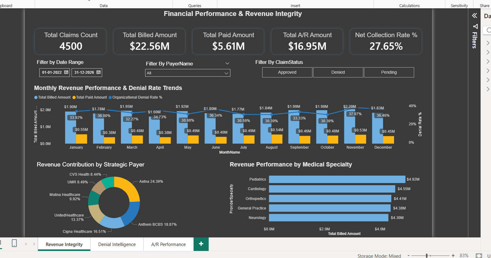
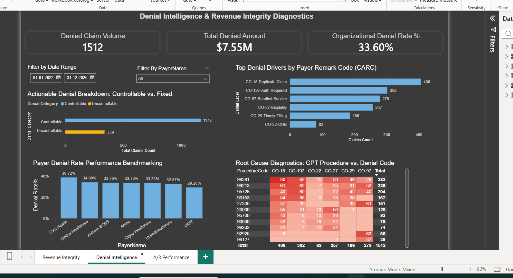
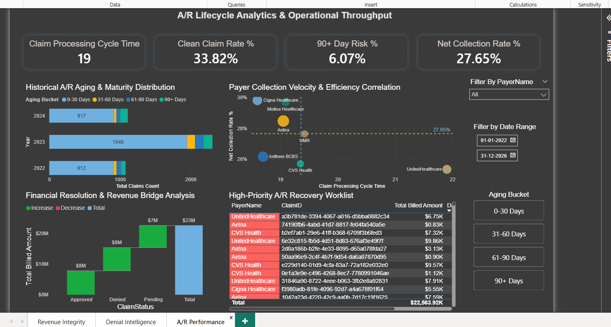

# 🏥 Healthcare Revenue Cycle & Denial Intelligence Suite
### *An End-to-End Power BI & SQL Analytics Solution*

## 📋 Project Overview
This project transforms raw, fragmented medical claims data into a high-performance **Star Schema** to drive executive decision-making and operational efficiency. Drawing on **9 years of SME experience** in Claims Adjudication, I engineered this suite to bridge the gap between complex billing codes (**CARC/RARC**) and actionable financial insights.

## 🚀 Key Features & Business Impact

### 1. Revenue Integrity (Page 1)
Provides a "Single Source of Truth" for **$22M+ in Billed Charges**, tracking the correlation between monthly submission volume and the **Net Collection Rate (27.65%)**.

### 2. Denial Intelligence (Page 2)
Uses SME-driven logic to categorize denials into **"Controllable" vs. "Fixed"** buckets. Features a **CPT-to-CARC Root Cause Matrix** to identify systemic errors in high-volume procedures (e.g., Authorization required vs. Duplicates).

### 3. A/R Performance & Recovery (Page 3)
Identifies revenue at risk via an **A/R Aging Maturity Distribution**. Includes a **Payer Velocity Scatter Plot** to benchmark collection efficiency (**Cycle Time vs. Paid %**) and a **High-Priority Worklist** for immediate A/R follow-up.

## 🛠️ Technical Stack
*   **Database:** SQL Server (T-SQL)
*   **Data Modelling:** Star Schema (`Fact_Claims` linked to `Dim_Patient`, `Dim_Provider`, `Dim_Payer`, `Dim_Date`, and `Dim_Claims`)
*   **ETL:** Advanced SQL joins for precision matching of Claim IDs and Procedure Codes.
*   **Visualization:** Power BI (**DAX**)
*   **Key DAX Measures:** Clean Claim Rate %, 90+ Day Risk %, Organizational Denial Rate, and Aging Buckets.

## 📈 Business KPIs Solved
*   **Clean Claim Rate (33.82%):** Identifying training opportunities for front-end billing.
*   **Average Cycle Time (19 Days):** Benchmarking payer adjudication speed.
*   **Denial Concentration:** Mapping **CO-18** and **CO-197** codes to specific CPTs to reduce "Controllable" revenue leakage.
## 🔒 Data Privacy
> **Note on Data:** This project utilizes synthetic, de-identified data. While Payer names and CPT/CARC codes are representative of real-world healthcare scenarios, all patient and financial values have been generated for demonstration purposes to ensure HIPAA compliance.

